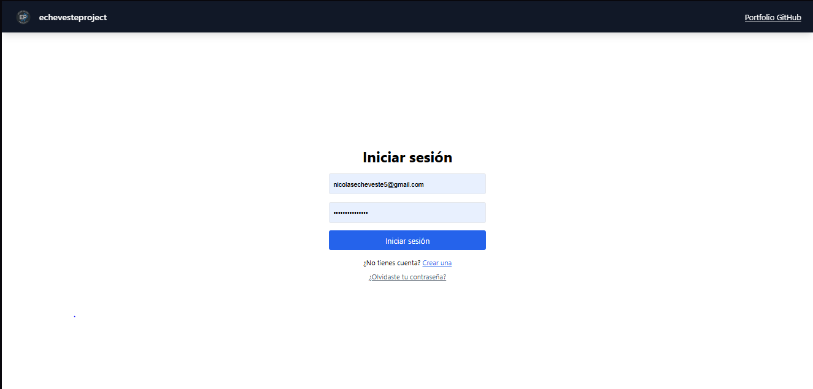
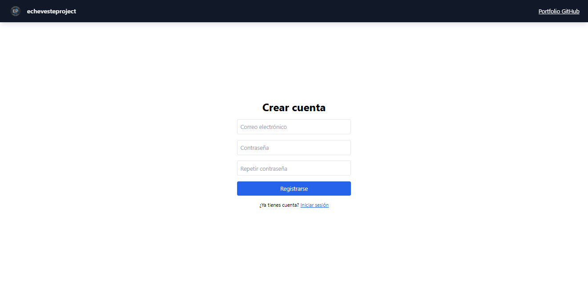
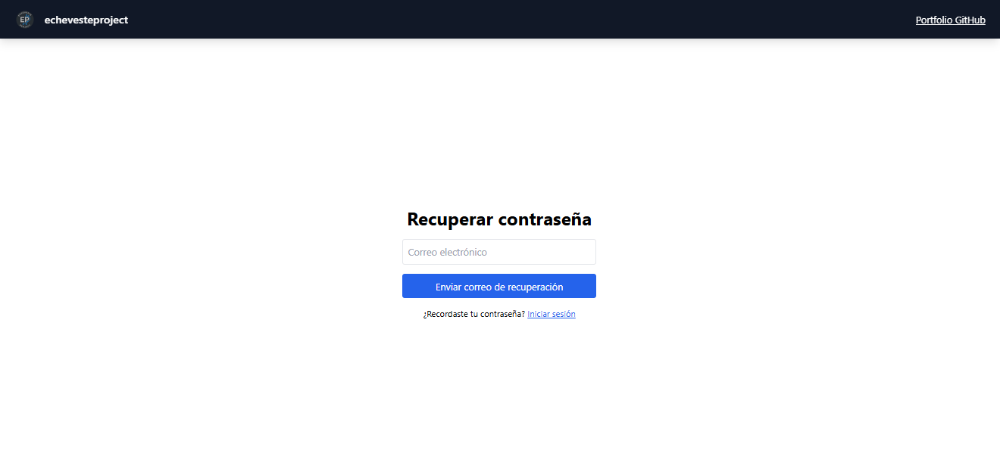
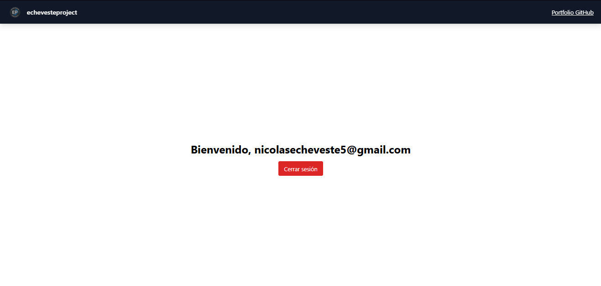

# 🔐 Login y Registro con Firebase + React

Este proyecto demuestra un sistema completo de autenticación de usuarios utilizando **React**, **Firebase Authentication** y **TailwindCSS**, siguiendo principios de **modularidad**, **código limpio** y **arquitectura escalable**.

---

## 🚀 Funcionalidades

✅ Registro de usuarios  
✅ Login con email y contraseña  
✅ Validaciones personalizadas en ambos formularios  
✅ Errores de Firebase traducidos a mensajes claros  
✅ Rutas protegidas para usuarios autenticados  
✅ Dashboard con detección de sesión activa  
✅ Cierre de sesión  
✅ Código modular y comentado, ideal para CV/portafolio

---

## 🛠️ Tecnologías usadas

- [React](https://react.dev/)
- [React Router DOM](https://reactrouter.com/)
- [Firebase Auth](https://firebase.google.com/products/auth)
- [Tailwind CSS](https://tailwindcss.com/)

---

## 📂 Estructura del proyecto

src/
│
├── components/ # Componentes reutilizables (ProtectedRoute)
├── firebase/ # Configuración de Firebase
├── hooks/ # Hooks personalizados (useAuth)
├── pages/ # Páginas del sistema (Login, Register, ResetPassword, Dashboard)
└── App.jsx # Configuración de rutas

---

## 📸 Capturas






---

## 🔧 Cómo correr el proyecto

1. Ingresa a la siguiente url:

  [login-register-firebase-ep-module](https://login-register-firebase-ep.vercel.app)

2. Clona este repositorio:

```bash
git clone https://github.com/matiasecheveste/Portfolio-Modulos-Funcionales.git
cd firebase-auth-react
Instala las dependencias:

npm install
Crea tu proyecto en Firebase

Habilita el proveedor de autenticación con Email/Password

Crea un archivo src/firebase/config.js:

import { initializeApp } from 'firebase/app';
import { getAuth } from 'firebase/auth';

const firebaseConfig = {
  apiKey: 'TU_API_KEY',
  authDomain: 'TU_AUTH_DOMAIN',
  projectId: 'TU_PROJECT_ID',
  storageBucket: 'TU_STORAGE_BUCKET',
  messagingSenderId: 'TU_SENDER_ID',
  appId: 'TU_APP_ID',
};

const app = initializeApp(firebaseConfig);
export const auth = getAuth(app);
Corre el servidor:

npm run dev
```

✨ Créditos
Este proyecto fue desarrollado por Matías Nicolás Echeveste Cardozo como parte de su portafolio profesional bajo su firma EchevesteProject.

📄 Licencia
MIT © 2025 – Uso libre para fines educativos y demostrativos.
